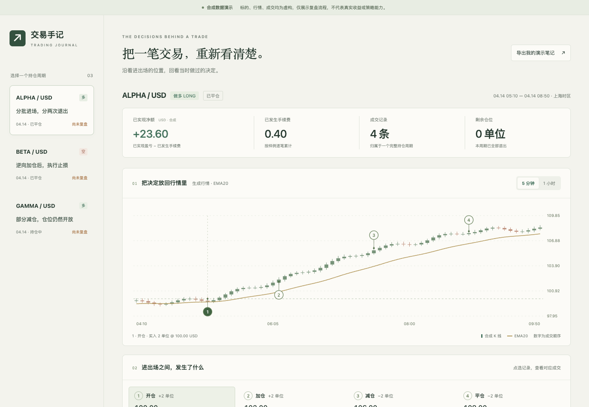

# 交易手记 · Trading Journal

一个独立编写的公开交互展示：把开仓、加仓、减仓和平仓放回同一个持仓周期，沿着图表回看，再留下结构化复盘。

**全部为合成数据。** ALPHA、BETA、GAMMA 是虚构标的，价格、成交、手续费和情景均为演示专门构造，不来自任何真实账户或历史行情，也不代表真实收益、策略效果或投资建议。

这个目录没有复制私有项目的源码、API 数据结构、真实成交或生产服务。它只展示产品交互方向，与真实交易应用的实现和数据连接独立。



## 运行

无需安装依赖、联网行情或 API key。在本目录运行：

```bash
python3 -m http.server 8923 --bind 127.0.0.1
```

打开 `http://127.0.0.1:8923/`。部署时，将本目录的 `index.html`、`style.css`、`demo.js`、`demo-model.js` 一起放在同一静态路径即可。所有资源使用相对路径。

## 可以实际操作什么

- 切换三个持仓周期：分批退出的多单、明确手工标注止损的空单，以及尚未完全退出的多单。
- 切换 5 分钟与 1 小时 K 线；1 小时数据由相同的 5 分钟 OHLC 汇总，EMA20 各自计算。
- 点击成交编号或明细，联动图表位置、买卖方向、成交后仓位、已实现盈亏和该条费用。
- 分别记录当时依据、出场原因、问题标签、下一次改进和明确的复盘完成状态。
- 在当前浏览器保存笔记，刷新后继续；导出 JSON 带走。禁止本地存储时会明确显示未保存，仍可导出当前输入。

止损原因来自样例显式记录，不是根据亏损反推。持仓中的样例可以完成当前阶段的复盘，但不会因此被标记为已平仓。

## 金额与数据边界

样例价格、费用以整数分保存，数量使用整数单位。移动平均成本仅用于这组经过校验的合成成交；当前示例的已实现盈亏均为整数分。没有实现可导入任意交易的生产级会计系统。

| 样例 | 已实现盈亏 | 已发生费用 | 已实现净额 | 剩余仓位 |
| --- | ---: | ---: | ---: | ---: |
| ALPHA 多单 | 24.00 | 0.40 | 23.60 | 0 |
| BETA 空单 | -12.00 | 0.32 | -12.32 | 0 |
| GAMMA 多单 | 2.00 | 0.16 | 1.84 | 3 |

单位为演示 USD。不计算剩余仓位浮盈亏，不模拟资金费、滑点或杠杆收益率。K 线为确定性生成，不是回测或真实行情重放。EMA20 使用前 20 根收盘价的简单平均作为初始值；图表只截取显示窗口，计算包含窗口前的数据。

笔记存储在当前浏览器的 `trading-journal-public-demo-v1` 项下，没有上传接口，不跨设备同步。导出文件包含用户在页面输入的文字；本目录的公开示例不会预填任何真实用户经历。

## 验证

```bash
node --test tests/model.test.cjs
```

测试覆盖多空盈亏与费用、加减仓后持仓、未平仓状态、非法减仓、K 线一致性、小时汇总、EMA 初值与笔记结构。网页支持窄屏；实际浏览器截图与验收记录放在 `output/playwright/`，不参与运行。

已在浏览器实测周期/成交/图表切换、笔记隔离与刷新保存、JSON 导出、存储禁用后的明确失败提示，以及 390px 窄屏。`screenshot.png` 是清空本机测试笔记后截取的 1360 × 940 默认页面，`screenshot-mobile.png` 为 390px 页面；没有伪造完成状态。
